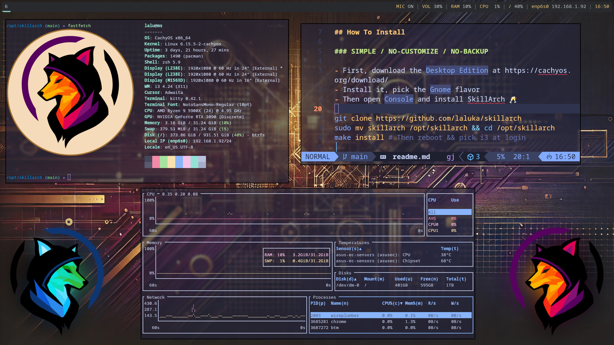

# SkillArch - [](https://github.com/laluka/skillarch/actions/workflows/cicd.yml)


> The lite/full install takes 10/15 minutes 🕑️\
> And here is a gentle rice 😇



---

## How To Install

### SIMPLE / NO-CUSTOMIZE / NO-BACKUP

> 🔴🎬🙏 Please watch this 5mn intro video to onboard yourself! 🙏🎬🔴

[](https://youtu.be/HB1hxJgGoDo)

- First, download the `Desktop Edition` at https://cachyos.org/download/
- Install it, pick the `Gnome` flavor
- Then open `Console` and install SkillArch 🥂

```bash
git clone https://github.com/laluka/skillarch
sudo mv skillarch /opt/skillarch && cd /opt/skillarch
make install # Then reboot && pick i3 at login

# Update by running this command (will pull changes & apply them):
ska-update-simple
```

###  ADVANCED / FULL-CUSTOMIZE / FULL-BACKUP

> 🔴🎬🙏 Please watch this 10mn intro video to onboard yourself! 🙏🎬🔴

[](https://youtu.be/Wq6CmJJnTJk)

1. [Fork this repo](https://github.com/laluka/skillarch/fork)
1. Install `your` SkillArch with the [usual install process](#simple--no-customize--no-backup)
1. Add the upstream source: `git remote add upstream https://github.com/laluka/skillarch.git`
1. When you'll want to `add a tweak` or  `update your setup` 🫶

```bash
# Update by running this command (simply follow the process):
ska-update-advanced

# "The process" is mostly like below:
# SAVE your changes on your repo
git add foo ; git commit -m i-added-foo ; git push
# Then, from a CLEAN git state
ska && git status
# PULL & CHECKOUT upstream changes
git fetch upstream && git checkout main
# MERGE upstream changes
git merge upstream/main
# SAVE your new current state
git push origin main
# Check & Compare your current drift from upstream
git diff upstream/main
# Reapply with latest changes
ska-update-simple
```

> ⚠️ Remember to NEVER add secrets in your dotfiles 🙏\
> ⚠️ Your fork is also PUBLIC, use `source ~/.myaliases` instead!\
> ⚠️ I know git is hard, but it's so powerful it's worth it, trust me.

---

## Documentation

> 🔴🎬🙏 Please watch this 1h FULL TOUR video so you can make the most out of your SkillArch Adventure! 🙏🎬🔴

[](https://youtu.be/pUm7KEgM2g8)

### Get Help

```bash
make help
# Welcome to SkillArch! 🌹
# Usage: make [target]
# Targets:
#   help                Show this help message
#   install             Install SkillArch
#   install-base        Install base packages
#   install-cli-tools   Install system packages
#   install-shell       Install shell packages
#   install-docker      Install docker
#   install-gui         Install gui, i3, polybar, kitty, rofi, picom
#   install-gui-tools   Install system packages
#   install-offensive   Install offensive tools
#   install-wordlists   Install wordlists
#   install-hardening   Install hardening tools
#   update              Update SkillArch
#   docker-build        Build lite docker image locally
#   docker-build-full   Build full docker image locally
#   docker-run          Run lite docker image locally
#   docker-run-full     Run full docker image locally
#   clean               Clean up system and remove unnecessary files
```

> Or join the SkillArch Discord server 🍀\
> ➡️ https://discord.com/invite/tH8wEpNKWS ⬅️\
> Yes, I help in the SkillArch channel, not in DMs! 😇

### Ska Helpers, i3 bindings, aliases, tools

| Alias | Description |
|-------|-------------|
| `ska-help-aliases` | Fuzzy-find aliases |
| `ska-help-bindings` | Fuzzy-find i3 bindings |
| `ska-help-packages` | Fuzzy-find installed packages |
| `ska-sudo-unlock` | Unlock current user after 3 sudo fails |
| `ska-update-simple` | Update SkillArch repo & starts install |
| `ska-update-advanced` | Helper to Pull Upstream & merge |

### MISC Gotchas

- If `make install` or `ska-update-simple` loop on a y/n question, fix your pacman config first! 😉
- The main config is azerty (shhh I know), here is a reference to [tweak your config back to qwerty](https://github.com/CachyOS/cachyos-i3wm-settings/blob/develop/etc/skel/.config/i3/config)
- Kitty visual/rectangle select is done with `ctrl+alt+click/drag`, you're welcome!
- The docker `latest` is actually the `lite` image with everything CLI related
- The docker `full` image contains GUI stuff and wordlists
- Why `sleep` in `Makefile`? Building TOO fast was triggering github limit-rate
- No [CachyOs on ARM](https://discuss.cachyos.org/t/arm-future-for-cachyos/727), therefore no SkillArch on ARM.
- Extensions are installed for VsCode. Cursor packaging is weird, so while it's open: `ctrl+shift+p` > `Import VsCode Extensions`
- Chrome extensions are not installed by default. Have a look to [/config/chrome-extensions.lst](/config/chrome-extensions.lst)

### VM & VirtualBox Stuff

> I've had tons of issues with VirtualBox laterly, and things worked PERFECTLY on Gnome Boxes (from `qemu-full` and `gnome-extra`), I strongly suggest using it instead, see the install guide above.

- The `ska-vbox-install-guestutils` alias will auto-install `virtualbox-guest-utils`
- In `VirtualBox`, when i3 starts it will run `VBoxClient-all` for clipboard & goodies
- Transparency `CAN` work with `picom` but:
  - It requires to enable `enable hardware virtualization`
  - It is basically `very slow` even with a good GPU
  - I advise to `not` use it, but do your things, PR opens!
  - Currently it's only started in i3 while not running in an hypervisor
  - In `~/config/i3/config` : `killall -q picom ; grep -qF hypervisor /proc/cpuinfo || picom`

### Multiple Monitor

1. Open arandr & set your screen layout: Drag & Drop
1. Set your Primary screen: Right Click > Check `Primary`
1. Save your layout: Layout > Save As > `arandr-main-layout.sh`
1. Auto apply layout at login time:

```bash
echo "$HOME/.screenlayout/arandr-main-layout.sh &" > ~/.xprofile
chmod +x ~/.xprofile
# Logout, Login, should work first try!
```

- If for some reasons, multiple polybar appear, it's because no primary monitor is assigned
 - Check it's actually true: `polybar  --list-monitors` # Should have one primary label
 - Fix it by openin `arandr` + right click to set `primary` on your main screen.
 - Reload i3 with `mod+Shift+r`, then make it permanent, aka goto doc `Multiple Monitor`

### Docker Usage

https://hub.docker.com/r/thelaluka/skillarch

```bash
# lite image: CLI only
make docker-run
# full image: GUI stuff with X11 socket mounted!
make docker-run-full
```

### Main i3 bindings & aliases

- For aliases checkout [config/aliases](/config/aliases)

```bash
# Help
bindsym $mod+h exec kitty --title "Help: SkillArch Bindings" zsh -ic "ska-help-bindings"
bindsym $mod+Shift+h exec kitty --title "Help: SkillArch Aliases" zsh -ic "ska-help-aliases"
bindsym $mod+Control+h exec kitty --title "Help: SkillArch packages" zsh -ic "ska-help-packages"

# Sound & Light
bindsym XF86AudioRaiseVolume exec --no-startup-id pactl set-sink-volume @DEFAULT_SINK@ +10% && $refresh_i3status
bindsym XF86AudioLowerVolume exec --no-startup-id pactl set-sink-volume @DEFAULT_SINK@ -10% && $refresh_i3status
bindsym XF86AudioMute exec --no-startup-id pactl set-sink-mute @DEFAULT_SINK@ toggle && $refresh_i3status
bindsym XF86AudioMicMute exec --no-startup-id pactl set-source-mute @DEFAULT_SOURCE@ toggle && $refresh_i3status
bindsym XF86MonBrightnessUp exec --no-startup-id brightnessctl set +20%   # && notify-send --icon=/dev/null --expire-time=500 "Brightness +20%"
bindsym XF86MonBrightnessDown exec --no-startup-id brightnessctl set 20%- # && notify-send --icon=/dev/null --expire-time=500 "Brightness -20%"
bindsym $mod+Shift+l exec --no-startup-id brightnessctl set 1%
bindsym $mod+m exec pactl set-source-mute @DEFAULT_SOURCE@ toggle

# Term & Apps
bindsym $mod+Return exec /usr/bin/kitty
bindsym $mod+Shift+Return exec /usr/bin/google-chrome-stable
bindsym $mod+Shift+Q kill
bindsym $mod+space exec --no-startup-id rofi -show drun
bindsym $mod+Shift+space exec --no-startup-id rofi -show run
bindsym $mod+Control+space exec --no-startup-id rofi -show window

# Power & Lock
bindsym $mod+Escape exec rofi -show power-menu -modi power-menu:rofi-power-menu
bindsym $mod+l exec i3lock-fancy -f Bitstream-Vera-Serif -t 'Welcome back to SkillArch'

# Window & Workspace
bindsym $mod+Left focus left
bindsym $mod+Down focus down
bindsym $mod+Up focus up
bindsym $mod+Right focus right
bindsym $mod+Shift+Left move left
bindsym $mod+Shift+Down move down
bindsym $mod+Shift+Up move up
bindsym $mod+Shift+Right move right
bindsym $mod+h split h
bindsym $mod+v split v
bindsym $mod+f fullscreen toggle
bindsym $mod+BackSpace split toggle
bindsym $mod+s layout stacking
bindsym $mod+z layout tabbed
bindsym $mod+BackSpace layout toggle split
bindsym $mod+Shift+f floating toggle
bindsym $mod+Shift+BackSpace focus mode_toggle
bindsym $mod+q focus parent
bindsym $mod+ampersand workspace number $ws1
bindsym $mod+eacute workspace number $ws2
bindsym $mod+quotedbl workspace number $ws3
bindsym $mod+apostrophe workspace number $ws4
bindsym $mod+parenleft workspace number $ws5
bindsym $mod+minus workspace number $ws6
bindsym $mod+egrave workspace number $ws7
bindsym $mod+underscore workspace number $ws8
bindsym $mod+ccedilla workspace number $ws9
bindsym $mod+agrave workspace number $ws10
bindsym $mod+Shift+1 move container to workspace number $ws1
bindsym $mod+Shift+eacute move container to workspace number $ws2
bindsym $mod+Shift+3 move container to workspace number $ws3
bindsym $mod+Shift+4 move container to workspace number $ws4
bindsym $mod+Shift+5 move container to workspace number $ws5
bindsym $mod+Shift+6 move container to workspace number $ws6
bindsym $mod+Shift+egrave move container to workspace number $ws7
bindsym $mod+Shift+8 move container to workspace number $ws8
bindsym $mod+Shift+ccedilla move container to workspace number $ws9
bindsym $mod+Shift+agrave move container to workspace number $ws10
bindsym $mod+Shift+c reload
bindsym $mod+Shift+r restart

# Resize & Scratchpad
bindsym $mod+Shift+e exec "i3-nagbar -t warning -m 'You pressed the exit shortcut. Do you really want to exit i3? This will end your X session.' -B 'Yes, exit i3' 'i3-msg exit'"
bindsym Left resize shrink width 10 px or 10 ppt
bindsym Down resize grow height 10 px or 10 ppt
bindsym Up resize shrink height 10 px or 10 ppt
bindsym Right resize grow width 10 px or 10 ppt
bindsym Return mode "default"
bindsym Escape mode "default"
bindsym $mod+r mode "default"
bindsym $mod+r mode "resize"
bindsym $mod+shift+a move to scratchpad
bindsym $mod+a scratchpad show

# Custom Apps & Settings
bindsym $mod+p exec flameshot gui
bindsym $mod+Shift+p exec flameshot full -p ~/Pictures/
bindsym $mod+s exec pavucontrol
bindsym $mod+shift+s exec XDG_CURRENT_DESKTOP=GNOME gnome-control-center
bindsym $mod+e exec emote
bindsym $mod+b exec blueman-manager
bindsym $mod+w exec XDG_CURRENT_DESKTOP=GNOME gnome-control-center wifi
bindsym $mod+n exec nautilus
bindsym $mod+v exec vlc
bindsym $mod+c exec code
bindsym $mod+k exec cursor
```

### Installed Packages, Plugins, Tools

- For an exhaustive view inspect [/Makefile](/Makefile)

```bash
# Pacman Packages
arandr asciinema base-devel bat bettercap bison blueman bottom brightnessctl burpsuite bzip2 ca-certificates cloc cmake visual-studio-code-bin curl discord dmenu docker docker-compose dos2unix dragon-drop-git dunst emote eza expect fastfetch feh ffmpeg filezilla flameshot foremost fq fx gdb ghex ghidra git git-delta gitleaks glow gnupg google-chrome gparted gron guvcview hashcat htmlq htop hwinfo i3-gaps i3blocks i3lock i3lock-fancy-git i3status icu inotify-tools iproute2 jless jq kdenlive kitty kompare lazygit libedit libffi libjpeg-turbo libpcap libpng libreoffice-fresh libxml2 libzip llvm lsof ltrace make meld metasploit mise mlocate mplayer ncurses neovim net-tools ngrep nm-connection-editor nmap nomachine obs-studio-browser okular opensnitch openssh openssl parallel perl-image-exiftool php-gd picom pkgconf polybar postgresql-libs python-virtualenv qbittorrent re2c readline ripgrep rlwrap rofi signal-desktop socat sqlite sshpass superfile sysstat tmate tmux tor torbrowser-launcher traceroute trash-cli tree unzip vbindiff veracrypt vim viu vlc vlc-plugin-ffmpeg flapak websocat wget wireshark-qt xclip qsv xz yay zip zsh zsh-autosuggestions zsh-completions zsh-history-substring-search zsh-syntax-highlighting zsh-theme-powerlevel10k cronie tree-sitter audacity xorg-xhost archlinux-keyring jdk21-openjdk polkit-gnome

# Yay packages
ffuf gau pdtm-bin waybackurls cursor-bin fswebcam i3-battery-popup-git python-pipx rofi-power-menu fabric-ai-bin

# Flatpak packages
com.obsproject.Studio org.gnome.Snapshot

# Mise tools
usage pdm rust terraform golang python nodejs

# Mise golang tools
sw33tLie/sns glitchedgitz/cook x90skysn3k/brutespray sensepost/gowitness

# Pdtm tools
aix alterx asnmap cdncheck chaos-client cloudlist cvemap dnsx httpx interactsh-client interactsh-server katana mapcidr naabu notify nuclei proxify shuffledns simplehttpserver subfinder tldfinder tlsx tunnelx uncover urlfinder

# Pipx tools
argcomplete bypass-url-parser dirsearch exegol pre-commit sqlmap wafw00f yt-dlp semgrep

# OMZ plugins
colored-man-pages docker extract fzf mise npm terraform tmux zsh-autosuggestions zsh-completions zsh-syntax-highlighting ssh-agent

# VsCode Extensions
bibhasdn.unique-lines
eriklynd.json-tools
mechatroner.rainbow-csv
mitchdenny.ecdc
ms-azuretools.vscode-docker
ms-python.debugpy
ms-python.python
ms-python.vscode-pylance
ms-vscode-remote.remote-containers
ms-vscode-remote.remote-ssh
ms-vscode-remote.remote-ssh-edit
ms-vscode.remote-explorer
ms-vsliveshare.vsliveshare
pomdtr.excalidraw-editor
trailofbits.weaudit
yzane.markdown-pdf
zobo.php-intellisense

# Cloned Tools
https://github.com/LazyVim/starter
https://github.com/jpillora/chisel
https://github.com/ambionics/phpggc
https://github.com/CBHue/PyFuscation
https://github.com/christophetd/CloudFlair
https://github.com/minos-org/minos-static
https://github.com/offensive-security/exploit-database
https://gitlab.com/exploit-database/exploitdb
https://github.com/laluka/pty4all
https://github.com/laluka/pypotomux
https://github.com/hugsy/gef

# Clones Wordlists
https://github.com/brannondorsey/naive-hashcat/releases/download/data/rockyou.txt
https://github.com/swisskyrepo/PayloadsAllTheThings
https://github.com/1N3/BruteX
https://github.com/1N3/IntruderPayloads
https://github.com/berzerk0/Probable-Wordlists
https://github.com/cujanovic/Open-Redirect-Payloads
https://github.com/danielmiessler/SecLists
https://github.com/ignis-sec/Pwdb-Public
https://github.com/Karanxa/Bug-Bounty-Wordlists
https://github.com/tarraschk/richelieu
https://github.com/p0dalirius/webapp-wordlists
```

### Security

- `opensnitch` is here to help you block outgoing packets and connections
- `ufw` is here to help you block incoming packets and requests
- Be careful though, [docker iptables shenanigans bypass ufw rules](https://richincapie.medium.com/docker-ufw-and-iptables-a-security-flaw-you-need-to-solve-now-40c85587b563)

---

## Main Changes Since [Lalubuntu](https://github.com/laluka/lalubuntu)

| What | Lalubuntu | SkillArch |
|------|-----------|-----------|
| OS | Ubuntu | Arch |
| Install time | 60mn | 20mn |
| Terminal | Gnome | Kitty |
| i3 config | regolith | homemade |
| Install tool | ansible | Makefile |
| Img builds | packer | docker |
| Images | base,offensive,gui | lite,full |
| Quality of Life | decent | wow! |

---

## Kudos

> Let's be honest, I put stuff together, but the heavy lifting is done by these true gods 😉

- https://github.com/bernsteining/beep-beep
- https://github.com/CachyOS/cachyos-desktop
- https://github.com/davatorium/rofi
- https://github.com/Hyde-project/hyde
- https://github.com/jluttine/rofi-power-menu
- https://github.com/newmanls/rofi-themes-collection
- https://github.com/orhun/config
- https://github.com/regolith-linux/regolith-desktop
